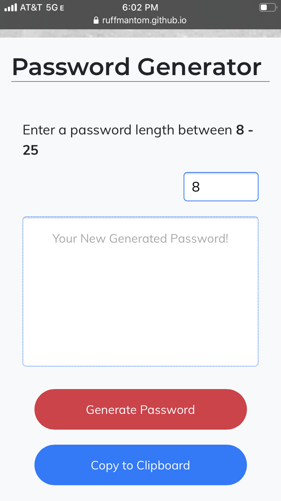

Welcome to my Read Me!
basically I had a lot of help with understanding how to implement this project in different ways starting with the most complicated way of using functions to get charAt in the character list then to an array that holds all the characters to now its all just in one variable and its simplest form. I watched a few videos but they all had checkboxes for adding chars when all I wanted to do was have one button for creating the password and one to copy. So I had to figure out how to use what they were showing me but make it work with only what I had. 

I didn't even think to take pictures of my before and afters but here is a picture of the finished product. 

 

